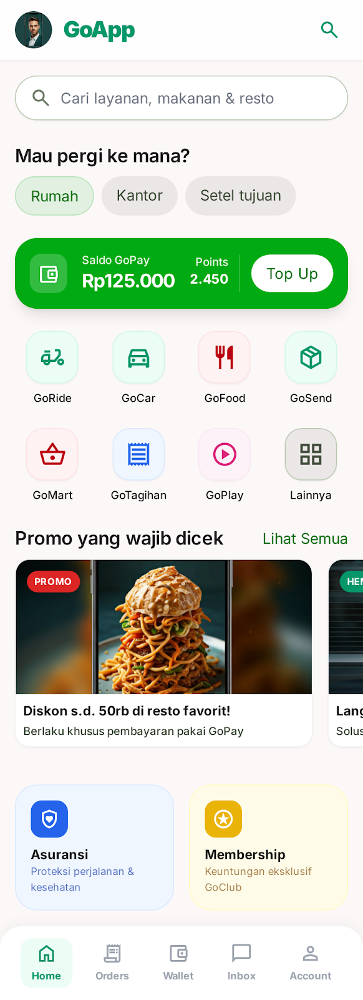
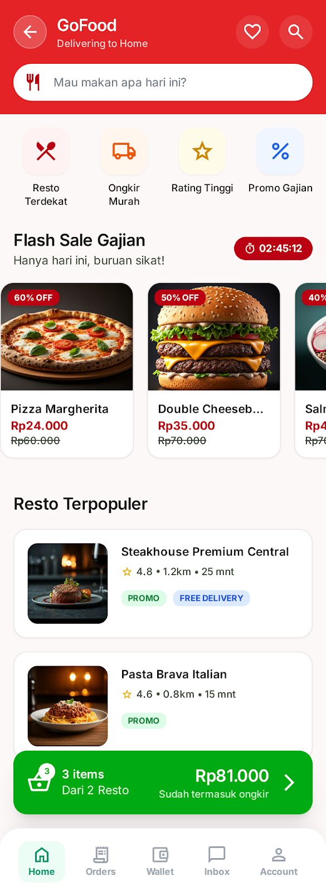
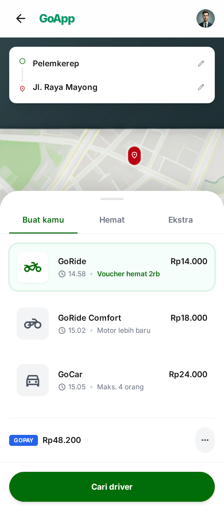
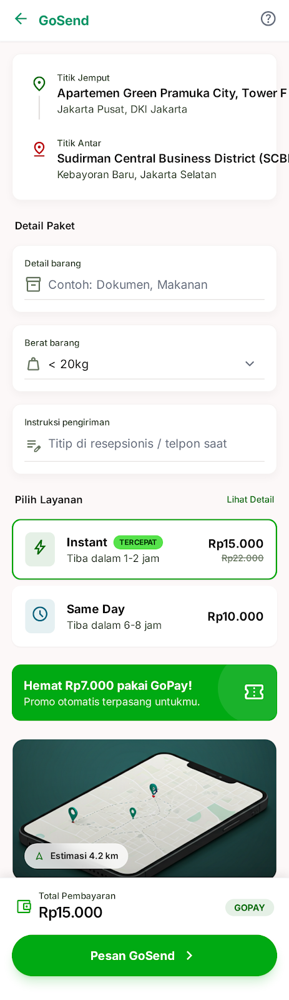
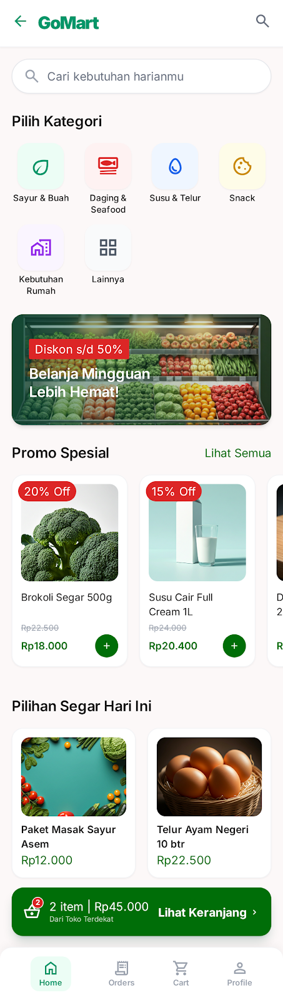
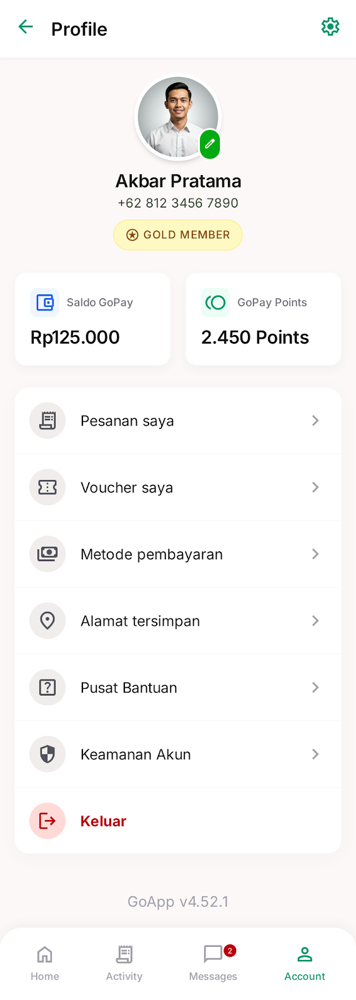

# Gojek Clone KMP 🚀

A full-featured Gojek application clone built with **Kotlin Multiplatform (KMP)** and **Compose Multiplatform**. This project demonstrates the power of sharing UI and business logic across Android, iOS, and Desktop platforms.

## 📱 Features

- **Home Screen**: Complete dashboard with GoPay wallet integration, service grids, and personalized promos.
- **GoRide & GoCar**: Ride-hailing UI with route selection, destination cards, and driver search sheets.
- **GoFood**: Food delivery experience featuring categories, flash sales, and restaurant listings.
- **GoSend**: Logistics interface for package delivery with address pinning and service selection.
- **GoMart**: Grocery shopping UI with category filtering and product showcases.
- **Profile**: Comprehensive user profile management, membership tiers (Gold Member), and transaction stats.
- **Responsive Design**: Optimized for mobile (Android/iOS) and Desktop environments.

## 🛠️ Tech Stack

- **Kotlin Multiplatform**: Share logic across platforms.
- **Compose Multiplatform**: Share UI across Android, iOS, and Desktop.
- **Material 3**: Modern design system implementation.
- **Kotlinx Coroutines**: Asynchronous programming.

## 🚀 Platforms

| Platform | Support |
| :--- | :--- |
| **Android** | ✅ Supported |
| **iOS** | ✅ Supported |
| **Desktop** | ✅ Supported |

## 🏗️ Project Structure

- `composeApp`: Main shared module containing UI and business logic.
  - `commonMain`: Shared code for all platforms.
  - `androidMain`: Android-specific implementations.
  - `desktopMain`: Desktop-specific implementations.
  - `iosMain`: iOS-specific implementations.

## 🚦 Getting Started

1.  **Clone the repository**:
    ```bash
    git clone https://github.com/akbarxleqi/gojekclone.git
    ```
2.  **Open in Android Studio**:
    Make sure you have the Kotlin Multiplatform plugin installed.
3.  **Run the app**:
    - For **Android**: Select `composeApp` and run on an emulator or device.
    - For **Desktop**: Run `./gradlew :composeApp:run`.
    - For **iOS**: Open the Xcode project in `iosApp` or run from Android Studio.

| Home Screen | GoFood | GoRide |
| :---: | :---: | :---: |
|  |  |  |

| GoSend | GoMart | Profile |
| :---: | :---: | :---: |
|  |  |  |

---
Made with ❤️ by Akbar
